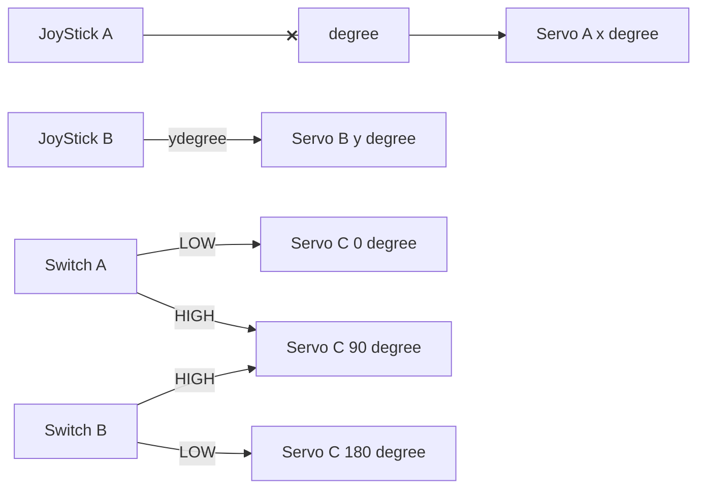

# ServoTest

問題解決技法で作成したサーボモータの制御プログラム

アナログスティックで情報読み取りをして、角度変化をつけている

```mermaid
flowchart LR

A[JoyStick A] --xdegree--> B[Servo A x degree]
C[JoyStick B] --ydegree--> D[Servo B y degree]

E[Switch A] --LOW--> F[Servo C 0 degree] 
E --HIGH--> G[Servo C 90 degree]

H[Switch B] --LOW--> I[Servo C 180 degree]
H --HIGH--> G
```
